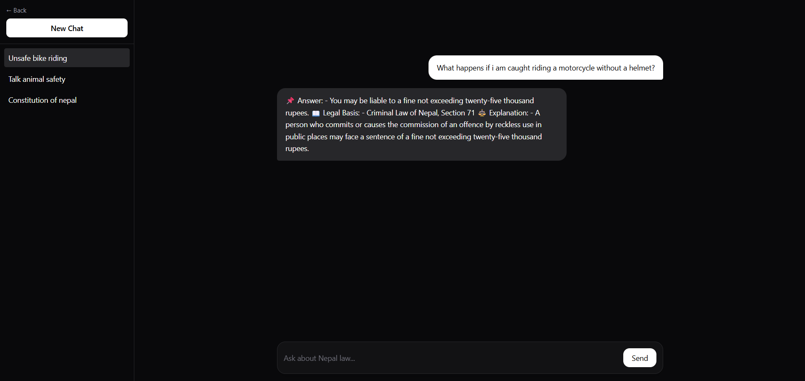
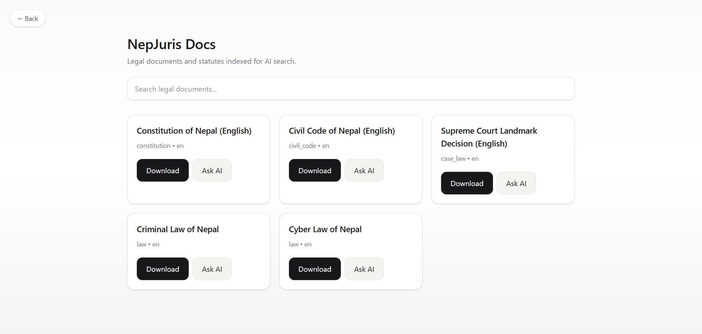
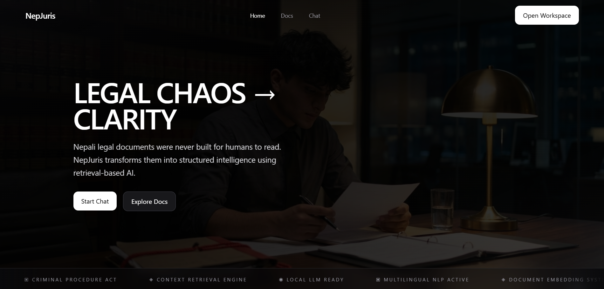

# NepJuris

**An offline-first, retrieval-grounded AI legal intelligence system for Nepali law.**

NepJuris is not a chatbot. It is a RAG-powered legal reasoning engine that retrieves context from a structured corpus of Nepali legal documents and generates responses grounded strictly in that retrieved content — no hallucinated statutes, no invented case law.

Built entirely with local infrastructure. No external APIs. No cloud dependency. Runs on a single `docker compose up`.

---

## The Problem

Nepal's legal system is inaccessible in practice. Primary legal documents — the Constitution, Civil Code, Criminal Code, Cyber Law, and Supreme Court decisions — exist as dense English PDFs scattered across government portals. For a law student, independent researcher, or citizen trying to understand their rights, there is no reliable way to query this corpus and get a grounded, citable answer.

General-purpose AI tools make this worse: they hallucinate statute numbers, invent provisions, and cite cases that don't exist. The problem isn't lack of AI — it's lack of *retrieval-grounded* AI trained on the actual documents.

NepJuris solves this by combining semantic retrieval over the real legal corpus with local LLM inference, enforcing a strict no-hallucination constraint at the prompt level.

---

## Corpus

NepJuris currently indexes the following documents (English PDFs):

| Document | Type |
|---|---|
| Constitution of Nepal 2015 | Constitutional Law |
| Civil Code of Nepal | Substantive Civil Law |
| Criminal Code of Nepal | Substantive Criminal Law |
| Cyber Law of Nepal | Regulatory / Digital Law |
| Supreme Court Landmark Decisions | Case Law / Precedent |

All documents are chunked, embedded, and indexed into a FAISS vector store at ingestion time.

---

## Architecture

```
User Query (Browser)
      ↓
React SPA — Nginx Container
      ↓
FastAPI Backend — RAG Engine
      ↓
FAISS Vector Store (local)
      ↓
SentenceTransformer Embeddings
      ↓
Context Formatter + Prompt Builder
      ↓
Ollama — LLaMA 3 8B (local inference)
      ↓
Retrieval-Grounded Legal Response
```

Every response is sourced from retrieved document chunks. The prompt explicitly prohibits the model from drawing on outside knowledge or fabricating legal references, and every answer is returned alongside the document, page, and article/section it was grounded in.

---

## Screenshots

| Chat | Docs |
|---|---|
|  |  |



---

## Stack

**Frontend**
- React + Vite (SPA, served via Nginx)
- TypeScript — core chat domain, API contracts, state types
- Tailwind CSS + Framer Motion
- Multi-workspace chat system with persistent localStorage state

**Backend**
- FastAPI — REST API + RAG pipeline orchestration
- PyMuPDF — PDF ingestion and text extraction
- SentenceTransformers — document and query embedding
- FAISS — vector similarity search
- Prompt engineering layer — strict legal grounding constraints

**Inference**
- Ollama running LLaMA 3 8B — fully local, no external API calls

**Infrastructure**
- Docker Compose — four-service orchestration (frontend, backend, ollama, nginx)
- Nginx — reverse proxy, `/api/*` → FastAPI, `/` → React SPA
- Internal Docker network — all inter-service communication contained

---

## Key Engineering Decisions

**Why FAISS over a managed vector DB?**
NepJuris is designed to run entirely offline. A managed vector store (Pinecone, Weaviate) would require outbound network access, breaking the offline-first constraint. FAISS runs in-process with the FastAPI backend.

**Why local LLM (Ollama) over OpenAI/Anthropic API?**
Legal documents contain sensitive queries. Sending them to an external API violates the privacy-first design principle. Ollama runs LLaMA 3 8B entirely inside the Docker network — no query ever leaves the machine.

**Why strict retrieval grounding?**
Legal AI that hallucinates is worse than no legal AI. The system prompt explicitly instructs the model to refuse to answer if retrieved context is insufficient, rather than generate a plausible-sounding but unsupported response.

**TypeScript migration strategy**
TypeScript is applied selectively to data integrity layers: API contracts (`api.ts`), chat state (`chat.types.ts`), and the single source of truth (`contracts.ts`). Pure UI rendering components remain in JSX — typed where it prevents bugs, not for coverage metrics.

---

## Project Structure

```
nepjuris/
├── docker-compose.yml
├── nginx.conf
├── frontend/
│   ├── Dockerfile
│   ├── .env
│   ├── dist/                   # production build (Vite output, built + served inside the frontend container; Nginx proxies to it)
│   └── src/
│       ├── pages/          # Home.jsx · Chat.tsx · Docs.jsx
│       ├── components/
│       │   ├── chat/       # TypeScript-migrated core system
│       │   ├── home/
│       │   ├── docs/
│       │   ├── layout/
│       │   └── ui/
│       ├── hooks/
│       │   └── useChat.ts
│       ├── services/
│       │   └── api.ts
│       ├── core/
│       │   └── contracts.ts
│       └── types/
│           └── chat.types.ts
│
└── backend/
    |__data/  
    ├── routes/
    │   ├── chat.py
    │   └── documents.py
    ├── services/
    │   └── chat_service.py
    |   |__ document_service.py
    ├── rag/
    │   ├── retriever.py
    │   ├── generator.py
    │   ├── context_formatter.py
    │   ├── embedder.py
    │   └── vector_store.py
    ├── pipeline/
    │   ├── extractor.py
    │   ├── chunker.py
    │   └── ingest.py
    └── main.py
    ├── Dockerfile
    ├── .env
```

---

## Running Locally

**Prerequisites:** Docker + Docker Compose

```bash
git clone https://github.com/bhattaridivya/nepjuris
cd nepjuris
docker compose up --build
```

The system automatically provisions all four containers and wires them over an internal Docker network. A one-shot `ollama-init` service pulls the LLaMA/Qwen model into a shared volume on first run, so no manual `ollama pull` step is required — on a fresh clone this can take a few minutes depending on connection speed, after which the backend waits for it to finish before starting. The repository ships with a pre-built FAISS index over the five-document corpus, so chat works immediately once startup completes.

Open `http://localhost` when startup completes.

To add a new document to the corpus, use the **+ Add Document** button on the Docs page: it uploads a PDF, extracts and chunks the text, embeds it, and adds it to the live FAISS index — no restart or separate ingestion step required. (For bulk re-indexing of the full catalog from scratch: `docker exec nepjuris-backend python -m pipeline.ingest`.)

---

## Features

- **Multi-workspace chat** — independent sessions, each with persistent history
- **Conversation memory** — follow-up questions carry recent chat context; the backend stays stateless, the frontend resends the last few turns with each request
- **Retrieval-grounded responses** — every answer sourced from actual document chunks
- **Scope classification** — every query is tagged `greeting` / `in_scope` / `out_of_scope` (e.g. non-Nepali jurisdiction) so citations only ever appear on answers actually grounded in the corpus
- **Inline citations** — each answer lists the source document, page, and article/section it drew from
- **Document browser** — metadata-aware corpus explorer with direct doc-to-chat interaction
- **Live document ingestion** — upload a new PDF from the UI and it's chunked, embedded, and searchable immediately
- **No-hallucination enforcement** — prompt-level constraint refusing unsupported answers
- **Fully offline** — zero outbound network dependency after initial model pull

---

## Known Gaps

- **No query rewriting for follow-ups.** Retrieval runs on the latest message only — a follow-up like "what about for married couples?" retrieves purely on that short text, not the resolved intent. The LLM still has the full conversation to reason over, so answers stay coherent, but retrieval quality on heavily context-dependent follow-ups is weaker than on a self-contained question.
- **No caching layer.** Every request re-embeds the query and re-invokes the LLM, even for repeated or near-identical questions.
- **Scope classification is self-reported.** The same LLM call that answers the question also tags its own scope (`greeting`/`in_scope`/`out_of_scope`) via structured output — there's no independent guardrail model, so a sufficiently adversarial prompt could still get it to mislabel.
- **No dedicated prompt-injection hardening.** Retrieved context and conversation history are passed to the model with only prompt-level instructions to disregard embedded instructions — there's no separate sanitization or detection layer.
- **Conversation history is client-held, not server-persisted.** History lives in the browser's `localStorage`; clearing it (or switching devices) loses context. There's no server-side session store.
- **No API rate limiting on this branch.** The `hosted` branch added a per-endpoint limiter (`rate_limiter.py`) since it's reachable over the public internet; this branch assumes local/trusted access via Docker Compose.

---

## What This Is (and Isn't)

NepJuris is a demonstration of production-grade RAG system design applied to a real-world legal accessibility problem in Nepal. It is not a substitute for legal counsel. It is a research and reference tool that grounds AI responses in primary legal sources.

---

## Testing & CI

- **Backend** — pytest unit tests for the pure-logic pipeline stages (chunking, header/footer stripping, citation formatting), linted with `ruff`. Runs on push/PR via `.github/workflows/backend-ci.yml`.
- **Frontend** — ESLint + production build check via `.github/workflows/frontend-ci.yml`.

---

## License

MIT — see [LICENSE](LICENSE).

---

*Built by Divya Bhattarai*
